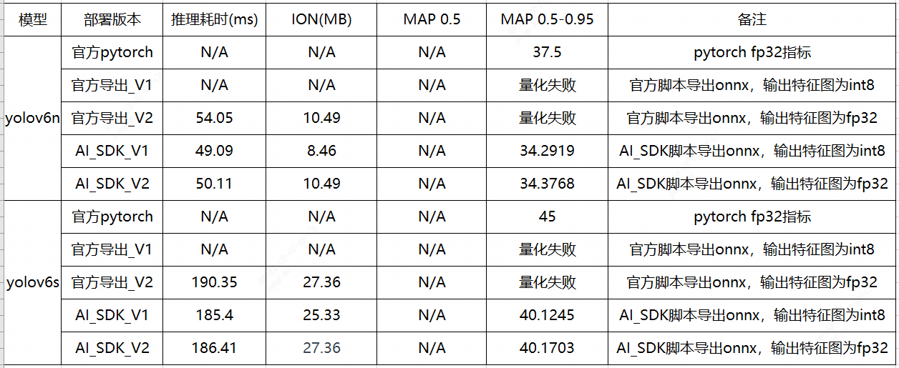

# 通用yolov6部署

## onnx模型导出

下载yolov6官方仓库 [meituan/YOLOv6](https://github.com/meituan/YOLOv6)，下载yolov6权重文件，在yolov6文件夹下新建一个目录`weights`，并将下载的权重文件放在目录`yolov6-main/weights/`下

修改`yolov6-main/deploy/export_onnx.py`文件，然后添加一个函数

```python
def detect_forward(self, x):
    
    final_output_list = []
    for i in range(self.nl):
        b, _, h, w = x[i].shape
        l = h * w
        x[i] = self.stems[i](x[i])
        cls_x = x[i]
        reg_x = x[i]
        cls_feat = self.cls_convs[i](cls_x)
        cls_output = self.cls_preds[i](cls_feat)
        reg_feat = self.reg_convs[i](reg_x)
        reg_output_lrtb = self.reg_preds[i](reg_feat)

        final_output_list.append(cls_output.permute(0, 2, 3, 1))
        final_output_list.append(reg_output_lrtb.permute(0, 2, 3, 1))

    return final_output_list
```

然后使用动态绑定的方式修改yolov6模型的`forward`，需要先`import types`，然后在`onnx export`之前添加下列代码

```python
...
print("===================")
print(model)
print("===================")

# 动态绑定修改模型detect的forward函数
model.detect.forward = types.MethodType(detect_forward, model.detect)

y = model(img)  # dry run

# ONNX export
try:
...
```

然后在`yolov6-main/`目录下输入如下命令，其中：

* `weights` 为pytorch模型文件的路径
* `img` 为模型输入尺寸
* `batch` 模型输入的batch
* `simplify` 简化onnx模型

```shell
python ./deploy/ONNX/export_onnx.py \
    --weights ./weights/yolov6n.pt \
    --img 640 \
    --batch 1
```

然后得到onnx模型

## cvimodel模型导出

cvimodel转换操作可以参考[appendix02-yolov5_model_deploy_helper](./appendix02-yolov5_model_deploy_helper.md)

## yolov6接口说明

提供预处理参数以及算法参数设置，其中参数设置：

* `YoloPreParam `输入预处理设置

  $y=(x-mean)\times factor$

  * factor 预处理方差的倒数
  * mean 预处理均值
  * use_quantize_scale 预处理图片尺寸
  * format 图片格式

* `YoloAlgParam`

  * cls 设置yolov6模型的分类

> yolov6是anchor-free的目标检测网络，不需要传入anchor

另外是yolov6的两个参数设置：

* `CVI_AI_SetModelThreshold ` 设置置信度阈值，默认为0.5
* `CVI_AI_SetModelNmsThreshold` 设置nms阈值，默认为0.5

```c++
// setup preprocess
YoloPreParam p_preprocess_cfg;

for (int i = 0; i < 3; i++) {
    printf("asign val %d \n", i);
    p_preprocess_cfg.factor[i] = 0.003922;
    p_preprocess_cfg.mean[i] = 0.0;
}
p_preprocess_cfg.use_quantize_scale = true;
p_preprocess_cfg.format = PIXEL_FORMAT_RGB_888_PLANAR;

printf("start yolov algorithm config \n");
// setup yolov6 param
YoloAlgParam p_yolov6_param;
p_yolov6_param.cls = 80;

ret = CVI_AI_Set_YOLOV6_Param(ai_handle, &p_preprocess_cfg, &p_yolov6_param);
printf("yolov6 set param success!\n");
if (ret != CVI_SUCCESS) {
    printf("Can not set Yolov6 parameters %#x\n", ret);
    return ret;
}

ret = CVI_AI_OpenModel(ai_handle, CVI_AI_SUPPORTED_MODEL_YOLOV6, model_path.c_str());
if (ret != CVI_SUCCESS) {
    printf("open model failed %#x!\n", ret);
    return ret;
}
// set thershold
CVI_AI_SetModelThreshold(ai_handle, CVI_AI_SUPPORTED_MODEL_YOLOV6, 0.5);
CVI_AI_SetModelNmsThreshold(ai_handle, CVI_AI_SUPPORTED_MODEL_YOLOV6, 0.5);

CVI_AI_Yolov6(ai_handle, &fdFrame, &obj_meta);

for (uint32_t i = 0; i < obj_meta.size; i++) {
    printf("detect res: %f %f %f %f %f %d\n", 
           obj_meta.info[i].bbox.x1,
           obj_meta.info[i].bbox.y1,
           obj_meta.info[i].bbox.x2, 
           obj_meta.info[i].bbox.y2, 
           obj_meta.info[i].bbox.score,
           obj_meta.info[i].classes);
  }
```

## 测试结果

转换了yolov6官方仓库给出的yolov6n以及yolov6s，测试数据集为COCO2017

其中阈值参数设置为：

* conf_threshold: 0.03
* nms_threshold: 0.65



