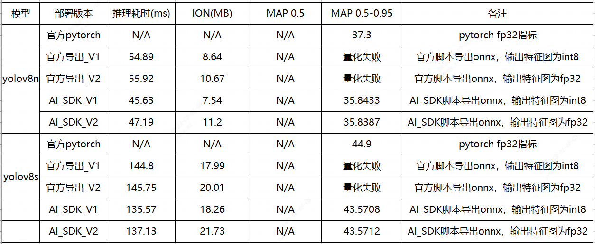

# 通用yolov8部署

首先获取yolov8官方仓库代码[ultralytics/ultralytics: NEW - YOLOv8 🚀 in PyTorch > ONNX > OpenVINO > CoreML > TFLite (github.com)](https://github.com/ultralytics/ultralytics)

```shell
git clone https://github.com/ultralytics/ultralytics.git
```

再下载对应的yolov8模型文件，以[yolov8n](https://github.com/ultralytics/assets/releases/download/v0.0.0/yolov8n.pt)为例，然后将下载的yolov8n.pt放在`ultralytics/weights/`目录下，如下命令行所示

```
cd ultralytics & mkdir weights
cd weights
wget https://github.com/ultralytics/assets/releases/download/v0.0.0/yolov8n.pt
```

## onnx模型导出

调整yolov8输出分支，去掉`forward`函数的解码部分，并将三个不同的feature map的box以及cls分开，得到6个分支

具体的可以在`ultralytics/`目录下新建一个文件，并贴上下列代码

```python
from ultralytics import YOLO
import types

input_size = (640, 640)

def forward2(self, x):
    x_reg = [self.cv2[i](x[i]) for i in range(self.nl)]
    x_cls = [self.cv3[i](x[i]) for i in range(self.nl)]
    return x_reg + x_cls


model_path = "./weights/yolov8s.pt"
model = YOLO(model_path)
model.model.model[-1].forward = types.MethodType(forward2, model.model.model[-1])
model.export(format='onnx', opset=11, imgsz=input_size)
```

运行上述代码之后，可以在`./weights/`目录下得到`yolov8n.onnx`文件，之后就是将`onnx`模型转换为cvimodel模型

## cvimodel导出

cvimodel转换操作可以参考[appendix02-yolov5_model_deploy_helper](./appendix02-yolov5_model_deploy_helper.md)

## yolov8接口调用

首先创建一个`cviai_handle`，然后打开对应的`cvimodel`，在运行推理接口之前，可以设置自己模型的两个阈值

* `CVI_AI_SetModelThreshold` 设置conf阈值
* `CVI_AI_SetModelNmsThreshold` 设置nms阈值

最终推理的结果通过解析`cvai_object_t.info`获取

```c++
// create handle
cviai_handle_t ai_handle = NULL;
ret = CVI_AI_CreateHandle(&ai_handle);
  if (ret != CVI_SUCCESS) {
    printf("Create ai handle failed with %#x!\n", ret);
    return ret;
  }

// read image
VIDEO_FRAME_INFO_S bg;
ret = CVI_AI_ReadImage(strf1.c_str(), &bg, PIXEL_FORMAT_RGB_888_PLANAR);

// open model and set conf & nms threshold
ret = CVI_AI_OpenModel(ai_handle, CVI_AI_SUPPORTED_MODEL_YOLOV8_DETECTION, path_to_model);
CVI_AI_SetModelThreshold(ai_handle, CVI_AI_SUPPORTED_MODEL_YOLOV8_DETECTION, 0.5);
CVI_AI_SetModelNmsThreshold(ai_handle, CVI_AI_SUPPORTED_MODEL_YOLOV8_DETECTION, 0.5);
if (ret != CVI_SUCCESS) {
	printf("open model failed with %#x!\n", ret);
    return ret;
}

// start infer
cvai_object_t obj_meta = {0};
CVI_AI_YOLOV8_Detection(ai_handle, &bg, &obj_meta);

// analysis result
std::stringstream ss;
ss << "boxes=[";
for (uint32_t i = 0; i < obj_meta.size; i++) {
ss << "[" << obj_meta.info[i].bbox.x1 << "," << obj_meta.info[i].bbox.y1 << ","
   << obj_meta.info[i].bbox.x2 << "," << obj_meta.info[i].bbox.y2 << ","
   << obj_meta.info[i].classes << "," << obj_meta.info[i].bbox.score << "],";
}
```

## 测试结果

转换测试了官网的yolov8n以及yolov8s模型，在COCO2017数据集上进行了测试，测试平台为**cv1811h_wevb_0007a_spinor**，其中阈值设置为：

* conf: 0.001
* nms_thresh: 0.6


